# SpotiFire

SpotiFire is an intuitive iOS app designed for music enthusiasts looking to expand their auditory horizons. Built using Xcode Swift and integrated with the [Spotify API](https://developer.spotify.com/documentation/web-api), SpotiFire leverages Spotify's recommendation system to suggest personalized track selections based on user preferences.

The app begins with a simple sign-in process through Spotify, ensuring a secure connection to the user's music library. The home page serves as the central hub of the user’s Spotify music library. It provides a comprehensive view, featuring sections for liked tracks, saved albums, and user-created playlists. Additionally, it showcases the most listened-to tracks and artists, allowing for easier playlist creation that aligns with the user’s most frequented listening choices.

  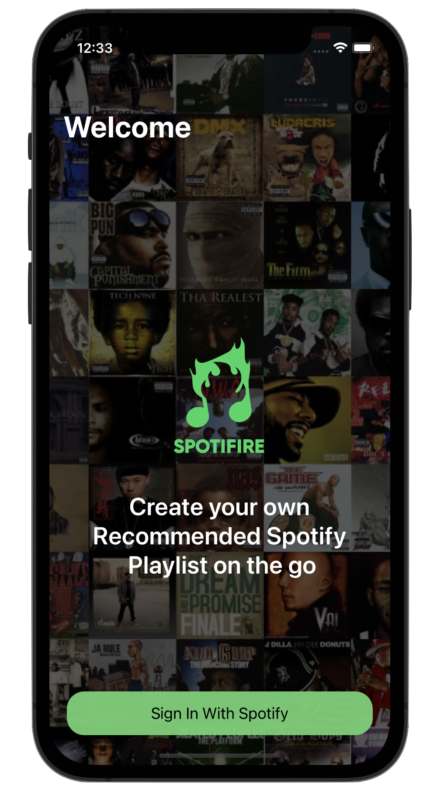
  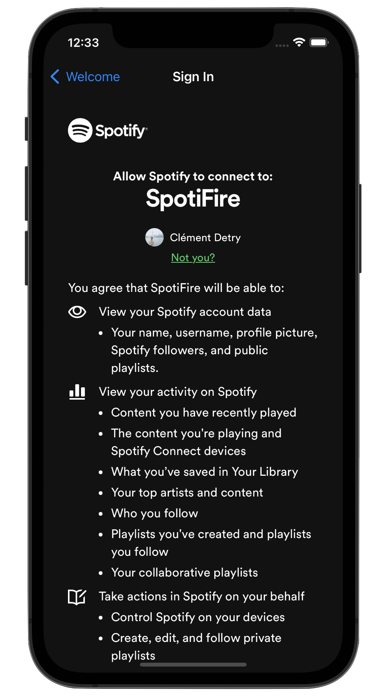
  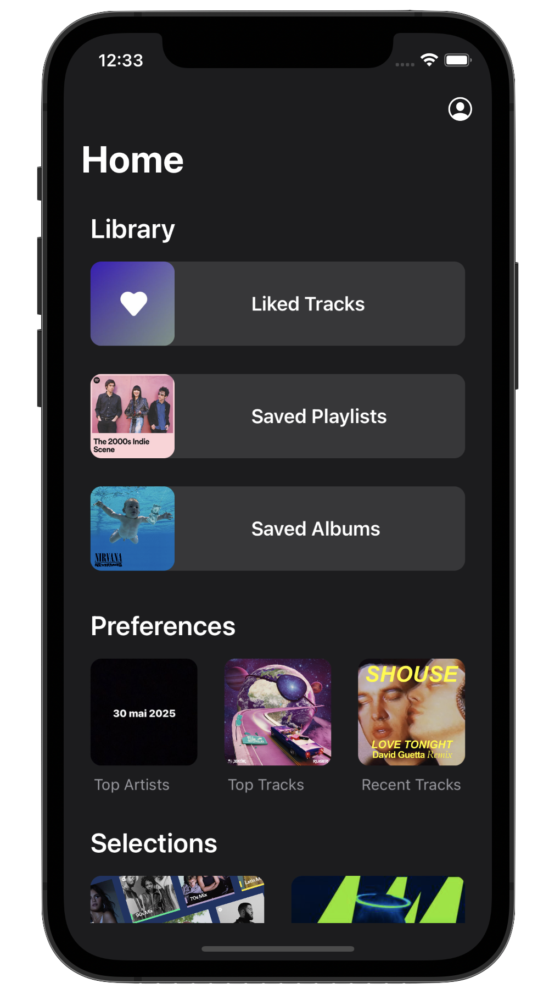

The playlists and albums pages give users a detailed overview of their existing music collections. Here, users can review and select from their saved content to inform the recommendations SpotiFire generates.

  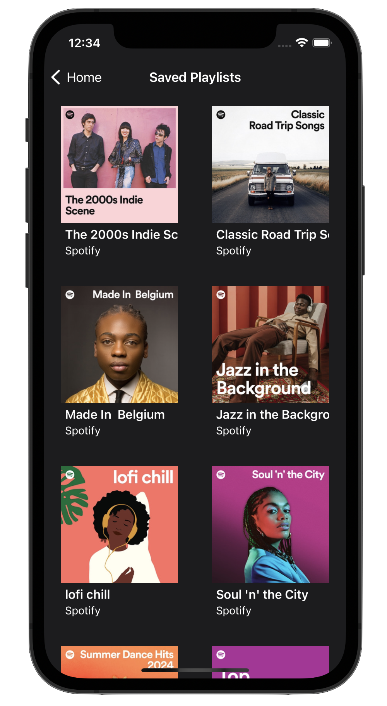
  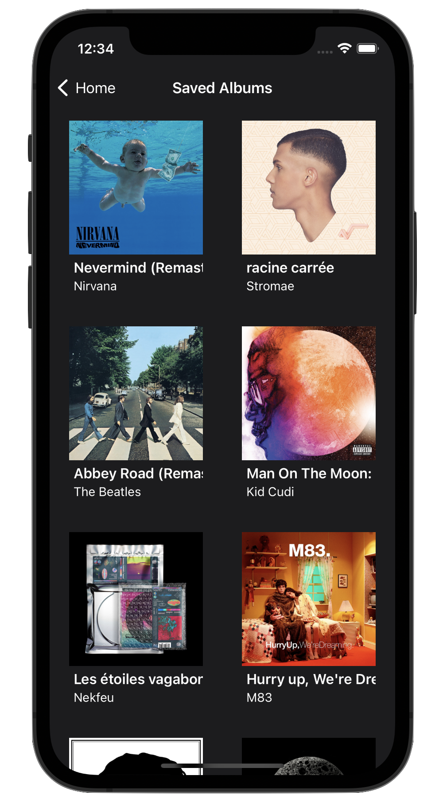

The SpotiFire app's recommendation pipeline offers a straightforward way of discovering new music. The following demonstration sequence illustrates this process through a step-by-step scenario.

1. **Track Selection Page**: Users select foundational tracks to inform the recommendation engine. This selection is critical as it directs the algorithm towards the user’s musical preferences. The screen displays a list of tracks, each with an option to be chosen as a seed for the upcoming recommendations.

2. **Parameter Settings Pop-up Window**: Here, users can fine-tune the recommendation process by setting parameters like the number of tracks to be recommended and the minimum popularity threshold. The interface provides sliders for adjusting these settings, offering control over the specificity and diversity of the recommended tracks.

3. **Recommendation and Selection Page**: Upon setting the parameters, the app generates a list of recommended tracks. Users then curate their playlist by selecting from these suggestions. The layout allows for easy selection, giving users the freedom to include or exclude tracks according to their preference. Alongside, users are presented with options to take immediate action: they can create a new playlist with the selected tracks, add them to an existing playlist, or place them directly into their listening queue.

4. **Playlist Naming Pop-up Window**: This step provides a prompt for the user to name their new playlist if this option has been selected. A dialogue box appears where users can enter a title, confirming their choice and proceeding to the creation of the playlist within the app.

5. **Success Confirmation Page**: Once a playlist is created, a confirmation message is displayed, signifying the completion of the process. This screen provides options to return to the home page or to open Spotify to access the newly created playlist.

6. **New Playlist Review**: The final screen shows the recently created playlist with the name and the tracks added.

  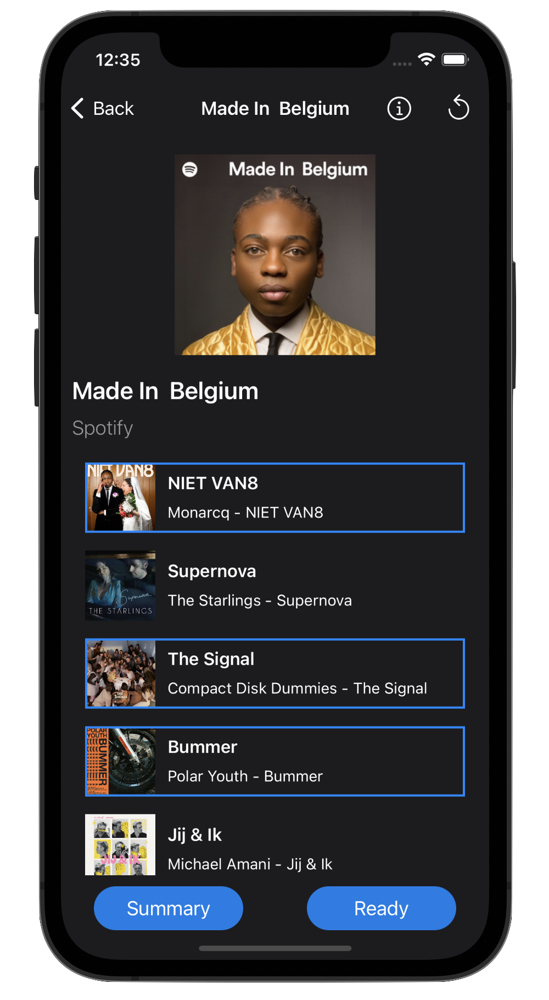
  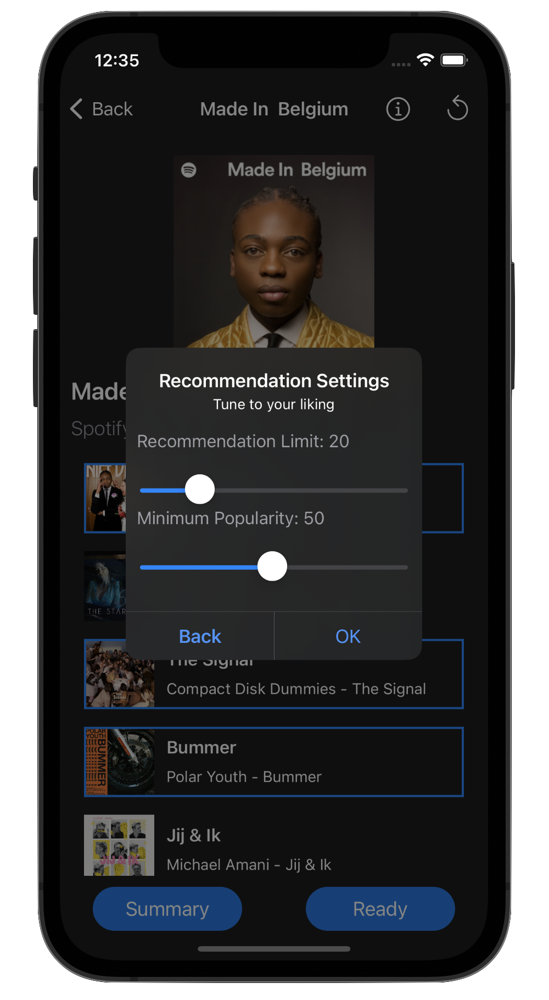
  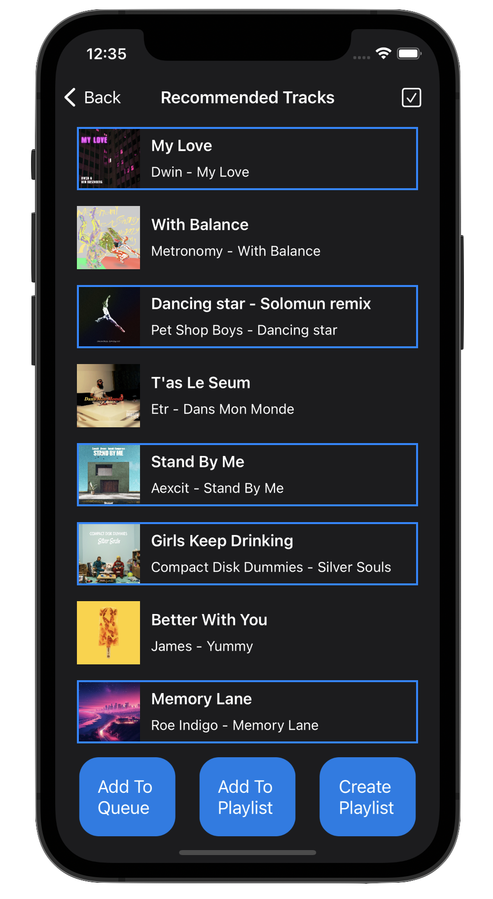

  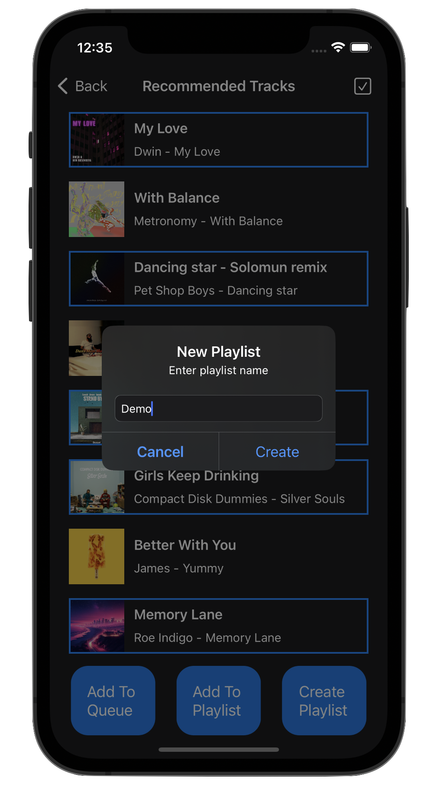
  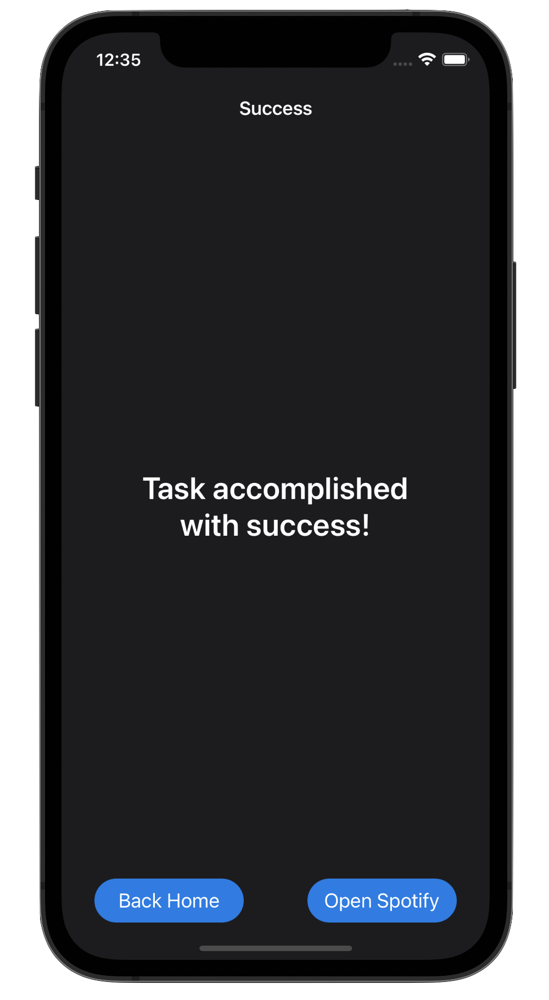
  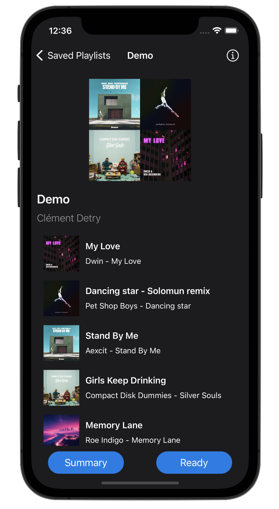

SpotiFire was developed as a personal project to explore application development and API integration. I designed it only for personal use, to better understand the process of building an app from scratch. Due to the project's nature and the regulatory requirements involved in scaling Spotify API access for wider use, SpotiFire was not released on the App Store and remains a private tool that I use for my own music selection.